# Azure VWAN 
## Proposal for a Network Segmentation User Interface
### Introduction
A VWAN hub & spoke topology is not segmented by default, permitting communication between all spokes and branches. There are two basic strategies to segment and control flows between spokes:
1.	Filtering: all spokes can route to each other via a firewall placed in the hub, with firewall policy controlling flows. All traffic flows through the central firewall and is visible in firewall logs.

2.	Routing: spokes are segmented into domains and can route without restriction within the same domain. Spokes are not aware of routes for anything outside of their domain. Domains may be connected, so that routing between spokes in those domains is possible.

The filtering approach is enabled through Azure Firewall or a firewall NVA in the VWAN hub. This is built and operated through graphical user interfaces in Firewall Manager, and Azure Firewall Policies or the firewall product’s policy management engine such as Checkpoint Provider1 or Palo Alto Panorama. These interfaces are well understood by users with a general understanding of networking. 

The Routing approach to segmentation in VWAN works through the custom routing capability (https://learn.microsoft.com/en-us/azure/virtual-wan/scenario-isolate-vnets-custom). This involves direct manipulation of routing tables and association and propagation, which requires expert knowledge of the VWAN technology. Customers and partners generally understand routing, but the specific implementation details in VWAN present a learning curve and can be a hurdle.

This document proposes a user interface overlay on the existing VWAN custom routing capability. It presents network segmentation functionally, abstracting the implementation detail of VWAN custom routing.
### Segmentation Domains
Spokes are grouped into Segmentation Domains. Routing within a Domain is unrestricted: all Spokes within a Domain learn each other’s routes. Routing across Domains is blocked by default: Spokes in one Domain do not learn routes to other Domains.

Branches (ExpressRoute- and VPN-connected sites) remain in a Default Domain, along with any Spokes that are not explicitly placed in any other Domain.
The scope of each Segmentation Domain is the entire Virtual WAN, meaning Domains span Hubs and there is no concept of a “local” or “per Hub” Domain. It is obviously possible to add only Spokes connected to a single Hub to a Domain, and no other Spokes. However, the Domain itself exists in the entire Virtual WAN, and Spokes connected to other Hubs could be added to it. 

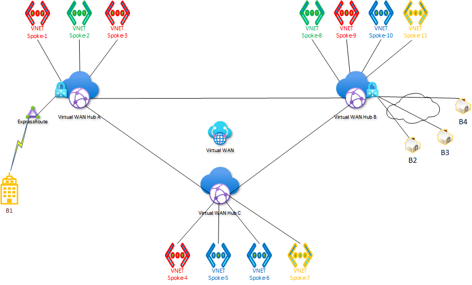

### Linked Groups
Cross Domain routing is enabled explicitly by grouping Domains into Linked Groups. Spokes then learn all routes for all Domains in the Group. Branch to Spoke routing is controlled by adding the Default Domain to one or multiple Linked Groups.

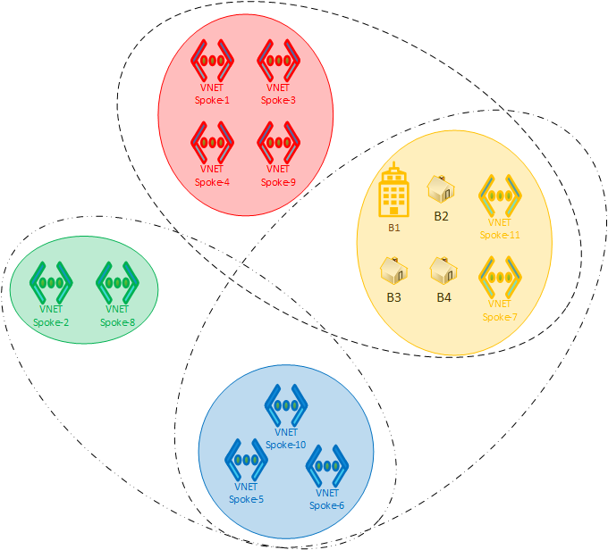

The connectivity matrix for the example in this diagram is as follows:

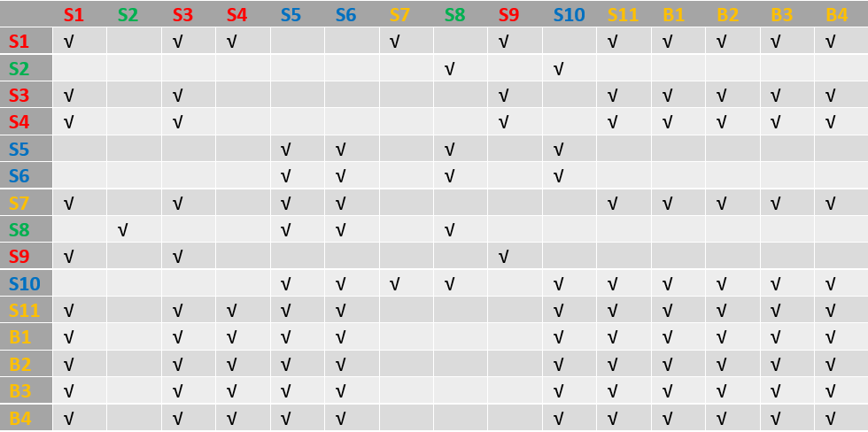

### User Interface
A Windows application, contained in this repository in the vwan-app-wpf folder, demonstrates an implementation of the VWAN Segmentation User Interface.
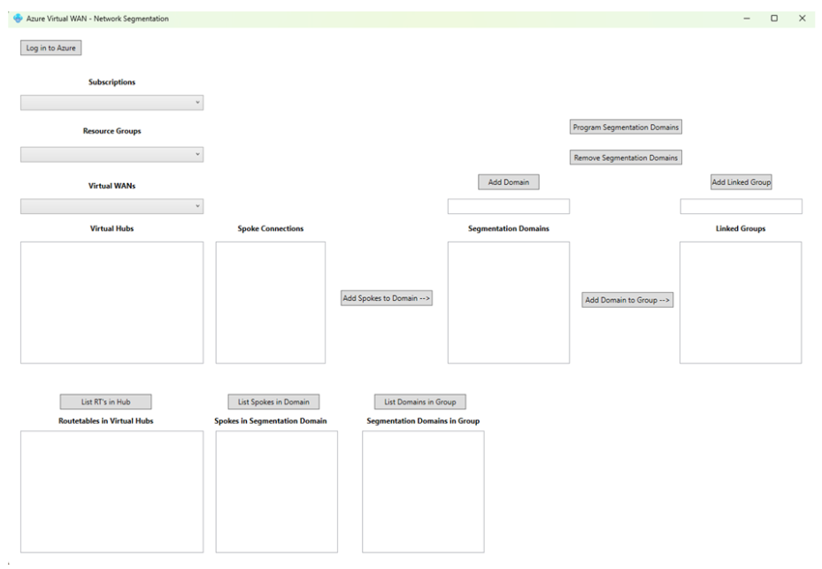

#### Subscription, Resource Group and Virtual WAN
After login to Azure, the user selects the subscription and resource group containing the target Virtual WAN from drop down boxes.
The Hubs in the VWAN instance selected are listed.
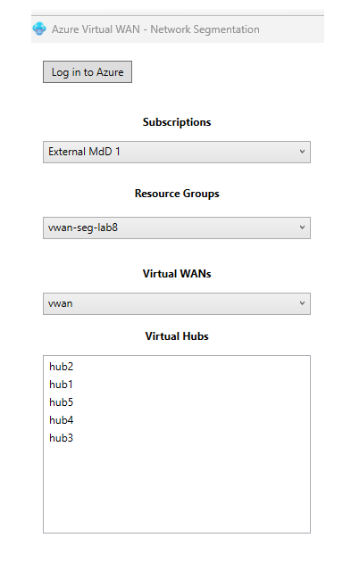
#### Select Hubs
User selects a Hub, and connected Spokes are listed:
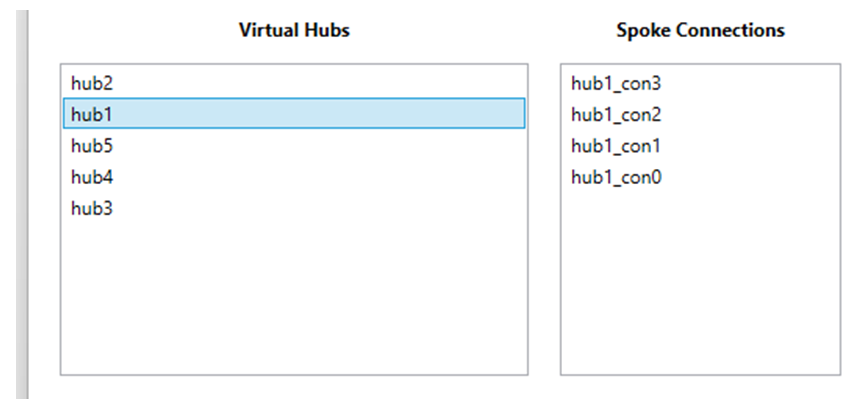
#### Create Segmentation Domains
User enters name of Segmentation Domain to be created in text box and clicks Add Domain:
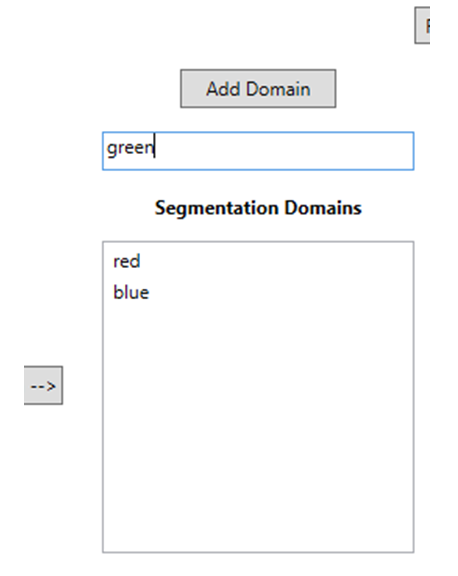
#### Add Spokes to Domains
User now adds Spokes to Domains by selecting multiple Spokes under Spoke Connections, and one Domain under Segmentation Domains, and clicking Add Spokes to Domain:
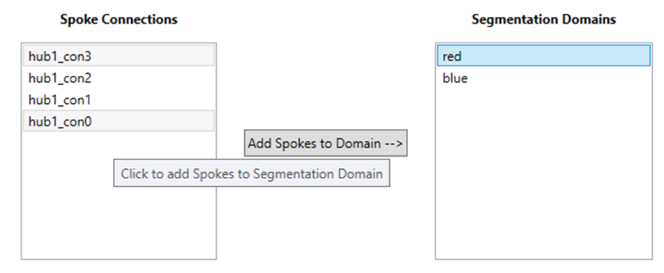
The process is repeated for Spokes connected to other Hubs.
#### Create Linked Groups
User can now create Linked Groups and add Domains to Groups, to enable Domain interconnectivity:
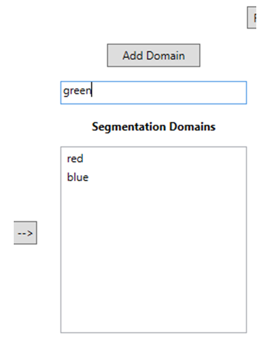
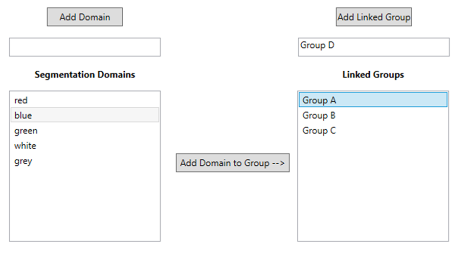
#### Commit
When configuration is complete, user commits to Azure by clicking Program Segmentation Domains.
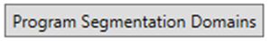
#### Inspect
The lower part of the application window contains elements to inspect the configuration.
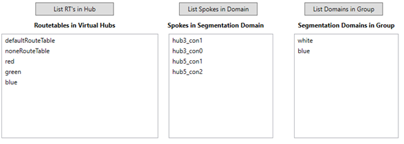
#### Implementation
The UI demonstration application is a .NET app written in C#. It leverages the Azure SDK for .NET.
The compiled installer is named `setup.exe` and located in the `vwan-app-wpf\bin\publish` folder.

### Lab
A Virtual WAN lab for experimentation with UI is contained in the `lab` folder. It is written in Bicep and deploys a VWAN instance with 5 hubs, and 5 spoke VNETs connected to each hub. It does not contain VM's or other components.
#### Deployment
Steps:
- Log in to Azure Cloud Shell at https://shell.azure.com/ and select Bash, or open a command prompt on your local machine.
- Ensure Azure CLI and extensions are up to date:
`az upgrade --yes`
- If necessary select your target subscription:
`az account set --subscription <Name or ID of subscription>`
- Clone the repo to Cloudshell or your local machine:
git clone https://github.com/mddazure/vwan-segmentation-ui
- Change directory:
`cd ./vwan-segmentation-ui/lab`
- Deploy Bicep template:
`az deployment sub create --location westeurope --template-file main.bicep`

This will deploy all resources to a Resource Group named `vwan-seg-lab`.

#### Experimentation
Install the vwan-app-wpf application:
- Copy the `publish` folder to your computer.
- Run setup.exe.
- Start the application.
- Start by clicking the Login to Azure button in the top left corner, select your Subscription, Resource Group `vwan-seg-lab` and VWAN instance `vwan` from the drop down boxes.
- Create Segmentation Domains.
- In Listboxes from leaft to right:
  - Select a Hub
  - Select one or multiple spokes
  - Select a Segmentation Domain
  - Click Add Spokes to Domain
  - Repeat steps as you want for other Hubs, Spokes and Domains.
- Optionally, create Link Groups and Add Domains to Groups
- Select multiple Groups in the Linked Groups box and connect them together by clicking Connect Link Groups
  - When all configuration is complete, commit by clicking Program Segmentation Domains.

